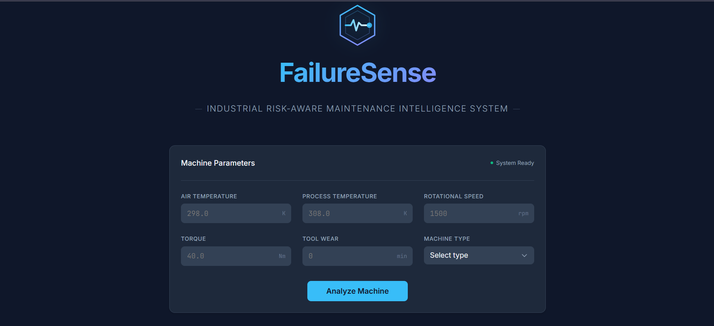
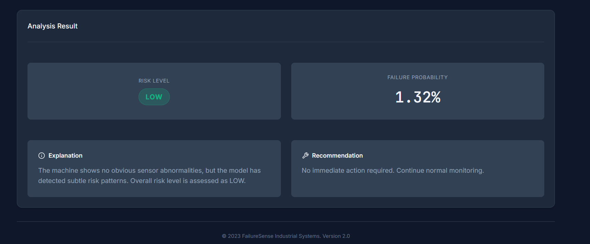
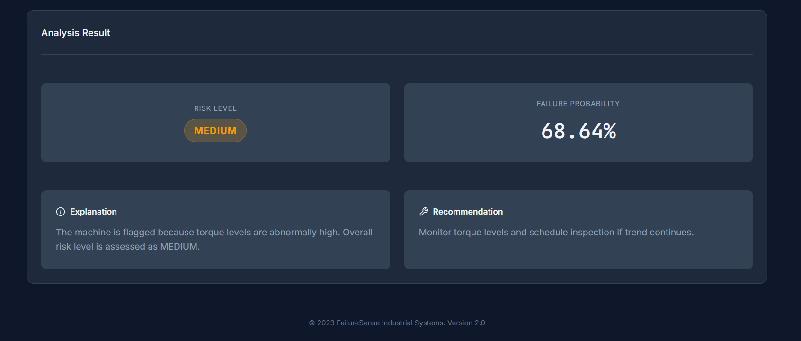
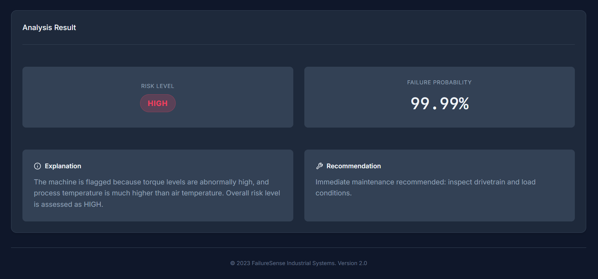

# FailureSense | Predictive Maintenance + Risk Intelligence 🧠⚙️

FailureSense is an end-to-end machine learning system built to predict rare industrial machine failures and convert probabilistic outputs into actionable, risk-aware maintenance decisions.

It demonstrates production-focused ML engineering practices like calibrated classification, recall-first threshold tuning, modular inference pipelines, FastAPI deployment, and a React + Vite dashboard integration.

---

### ✨ Key Features

* Calibrated failure probability prediction (rare-event focused)
* Recall-first threshold tuning for safety-sensitive environments
* Two-stage design: Prediction (Stage 1) + Decision Intelligence (Stage 2)
* Sensor anomaly detection + stress score computation
* Risk stratification: LOW / MEDIUM / HIGH
* Human-readable explanation engine
* Actionable maintenance recommendations
* Clean REST API contract for frontend integration
* Modular production inference pipeline under \`src/\`

---

### 🧠 Problem Statement

Industrial machines generate continuous telemetry, but failures are rare and extremely costly. Traditional rule-based monitoring often:

* miss early failure signals
* trigger excessive false alarms
* lack interpretability
* provide no structured decision support

FailureSense addresses this by combining statistical learning with operational risk intelligence to guide maintenance decisions.

---

## 🧩 System Design

### 🟢 Stage 1 - Failure Probability Estimation

Champion model: Gradient Boosting Classifier

* probability calibration applied
* optimized for rare-event recall
* cost-sensitive threshold tuning
* outputs calibrated failure probability

Answers: "How likely is this machine to fail?"

---

### 🟡 Stage 2 - Operational Risk Intelligence

Stage 2 converts statistical probability into structured decision support:

* sensor anomaly detection
* stress score computation
* risk stratification (LOW / MEDIUM / HIGH)
* explanation engine (human-readable)
* actionable maintenance recommendations

Answers: "What does this mean operationally, and what should we do?"

---

## 🏗 System Architecture

React Frontend (Vite)  
↓  
FastAPI Backend  
↓  
Production Inference Pipeline (\`src/\`)  
↓  
Calibrated Model Artifacts (\`models/\`)

Architecture principles:

* clear separation between UI, API, and ML logic
* model artifacts versioned independently
* business logic decoupled from statistical prediction
* REST-based communication
* scalable structure suitable for containerization

---

## 📸 Dashboard Screenshots

### 🔹 Machine Input Dashboard

  

---

### 🟢 Low Risk Assessment

  

---

### 🟡 Medium Risk Assessment

  

---

### 🔴 High Risk Assessment

  

---

### 📦 Project Structure

\`\`\`text
FailureSense/
│
├── src/
│   ├── inference.py
│   ├── preprocessing.py
│   └── stage2_logic.py
│
├── models/
│   ├── calibrated_gb.pkl
│   └── screening_threshold.pkl
│
├── frontend/
├── app.py
├── requirements.txt
└── README.md
\`\`\`

---

## 🔌 API Specification

### POST /predict

#### Request

\`\`\`json
{
  "air_temp": 298.5,
  "process_temp": 308.2,
  "rotational_speed": 1500,
  "torque": 42.3,
  "tool_wear": 120,
  "machine_type": "M"
}
\`\`\`

#### Response

\`\`\`json
{
  "risk_score": 0.8421,
  "risk_level": "HIGH",
  "abnormal_sensors": {
    "high_tool_wear": true,
    "high_torque": true,
    "high_temp_diff": false
  },
  "explanation": "High torque and elevated tool wear indicate increased mechanical stress.",
  "recommendation": "Schedule immediate inspection and preventive maintenance."
}
\`\`\`

---

### 🛠 Tech Stack

* Backend: Python, FastAPI, scikit-learn, joblib
* Frontend: React, Vite
* ML: Gradient Boosting + Probability Calibration
* Version Control: Git, GitHub

---

### ▶ Running Locally

#### Backend

\`\`\`bash
pip install -r requirements.txt
python -m uvicorn app:app --reload
\`\`\`

Runs at:

http://127.0.0.1:8000  
Docs: http://127.0.0.1:8000/docs  

---

#### Frontend

\`\`\`bash
cd frontend
npm install
npm run dev
\`\`\`

Runs at:

http://localhost:5173  

---

### ⚙ Key Engineering Decisions

* strict separation of prediction and decision logic
* recall-first optimization for safety sensitivity
* calibrated probabilities for reliable interpretation
* modular inference pipeline under \`src/\`
* clean REST API integration

---

### 🚧 Future Improvements

* Docker containerization
* Cloud deployment
* Automated testing
* Model drift detection
* Logging and observability
* CI/CD integration

---

### 📄 License

Developed for educational and portfolio demonstration purposes.
EOF
